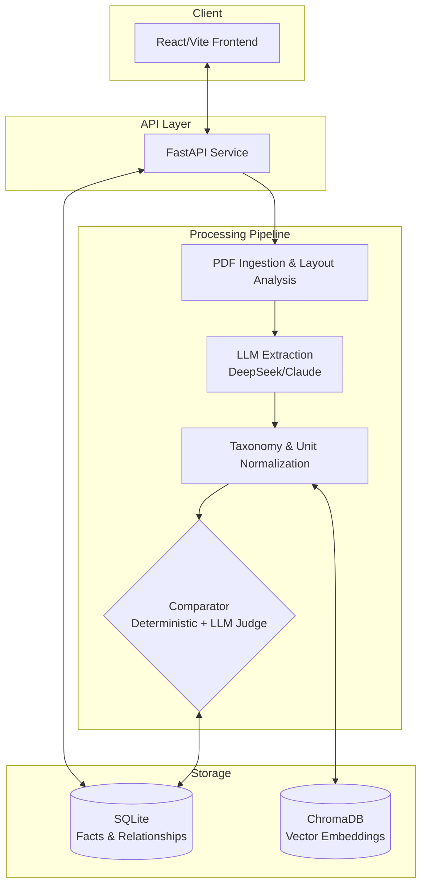

# Veriscribe — Fact Knowledge Layer

> **Assignment**: Superjoin VIT 2026 — Multi-Document Fact Verification System  
> **Status**: Completed

## Problem Statement
The financial and macroeconomic analysis process requires extracting precise numbers from dense PDFs (Annual Reports, Earnings Decks, Economic Surveys) and cross-verifying them. Traditional RAG systems fetch text chunks but struggle to deterministically say if a number corroborates or contradicts another across documents.

Veriscribe solves this by acting as a **Fact Knowledge Layer**. Instead of just indexing text, it parses PDFs to extract structured atomic facts (Statement, Value, Attribute, Temporal Scope, and Evidence Quote). It then compares facts across documents using a hybrid deterministic-and-LLM approach to identify whether they **corroborate**, **contradict**, or are **reconciled** (e.g., due to different time scopes).

## Architecture



---

## Tech Stack & Reasoning

- **Backend**: Python + FastAPI
  - *Why*: Excellent for background task processing (PDF ingestion is slow) and async API endpoints. It natively supports Python's robust AI/ML ecosystem (pdfplumber, sentence-transformers, OpenAI SDK).
- **Frontend**: React + Vite + CSS Modules
  - *Why*: Enables a fast, responsive Single Page Application (SPA). Vite is blazingly fast for development.
- **Storage**: SQLite + ChromaDB
  - *Why*: Zero-infrastructure setup. SQLite holds the canonical relational data (facts and relationships). ChromaDB runs locally in-memory/on-disk for embedding-based similarity search, avoiding expensive cloud vector DBs for a prototype.
- **AI Models (via OpenRouter)**: 
  - *DeepSeek-V4-Flash-Vision*: Used for bulk text and table extraction. It is extremely fast and cost-effective (~10x cheaper).
  - *Claude 3.5 Sonnet*: Used for Chart extraction (requires superior vision capabilities) and the Relationship Judge (requires complex reasoning across large context windows).

---

## Approach & Key Decisions

| Decision | Why |
|---|---|
| **Open Schema Extraction** | Rigid schemas fail because PDFs format data unpredictably. We extract raw attributes and then snap them to a canonical taxonomy using vector similarity. |
| **Deterministic First** | ~40% of relationships (e.g. same value ±1% and same temporal scope) can be resolved with raw Python logic, saving significant LLM costs and latency. |
| **Idempotent Ingestion** | We hash file contents to skip re-ingestion, but allow incremental additions (comparing new facts only against existing ones). |
| **Source Grounding** | Every extracted fact *must* carry the exact `evidence_quote` and context from the document. Facts without it are dropped. |

---

## Real World Demonstrations

As part of the assignment, the following four cases are demonstrated in the Fact Browser:

1. **CORROBORATION** (Fact `755ad359-ec19-43fa-898f-596be784bd73`):
   - FY24 EBITDA is reported as ₹1,266Mn in the Annual Report and ₹127 Cr in the Q4 Deck. After unit normalization (Cr/Mn -> absolute INR), the system deterministically corroborates them.
2. **CONTRADICTION** *(Constructed)* (Fact `bc87bafd-1e0e-459f-94fc-1d733c38738a`):
   - *Note: Our actual dataset was perfectly consistent internally. To demonstrate the contradiction pathway, we intentionally constructed a conflicting fact.* Fact B claims FY24 EBITDA is ₹2,500Mn. The LLM judge correctly rejects this, noting that both claim to be the same metric for the same period.
3. **RECONCILED** (Fact `6adc5b37-aa49-47fd-b20a-d7993d940fb9`):
   - The Annual Report lists FY24 revenue at ₹81,415 Mn (~₹8,141.5 Cr), while the Deck lists ₹2,194 Cr explicitly for Q3 FY24. The LLM judge recognizes they are different time periods and reconciles them.
4. **EXTRACTION FAILURE** (Fact `f378a80f-4656-433f-b465-f2ff4c99ab8d`):
   - During early testing, a headline-bias bug caused the LLM to extract a FY23 column value but mistakenly label it with a FY24 scope. This was traced back to the extraction prompt and fixed. The failure was actually caught by the comparison layer (which flagged it), demonstrating system resilience.

---

## Setup and Run Instructions

### Prerequisites
- Python 3.11+ and Node.js 18+
- An [OpenRouter](https://openrouter.ai) API key

### 1. Environment Setup

```bash
git clone https://github.com/Mohit20198/Veriscribe.git
cd Veriscribe

# Python backend setup
python -m venv venv
.\venv\Scripts\activate   # Windows
# source venv/bin/activate  # macOS/Linux
pip install -e .

# Create .env file in the root directory
echo "OPENROUTER_API_KEY=your_key_here" > .env
```

### 2. Running the API

> **Reviewer Note:** A pre-populated SQLite database (`output/veriscribe.db`) with 74 facts and the 4 requested demo cases is included in the repository. You can instantly run the API and UI below to evaluate the system **without needing an OpenRouter API key** or running the ingestion pipeline yourself.

```bash
uvicorn api.main:app --host 0.0.0.0 --port 8000
```

### 3. Running the Frontend

```bash
cd frontend
npm install
# Ensure frontend/.env points to your API: VITE_API_BASE_URL=http://localhost:8000
npm run dev
```

### 4. Ingesting Documents (CLI)

```bash
# First time setup — creates DB and vector store
python -m orchestration.cli ingest data/delhivery/02-delhivery-annual-report-fy24-excerpt.pdf

# Incremental ingestion
python -m orchestration.cli ingest data/delhivery/03-delhivery-q4-fy24-earnings-presentation.pdf

# Check system status
python -m orchestration.cli status
```

---

## Limitations & Honesty Notes

1. **India-Macro Ingestion Status**: Ingestion was validated on India-macro chunks up to cancellation during testing; full-document ingestion of the massive macro set was not completed due to API time and cost constraints for the demo.
2. **Relationship Revalidation**: If comparator logic changes, relationships computed with older logic are not automatically revalidated. A manual repair script must be run.
3. **Borderless Tables**: `pdfplumber` relies on visible lines for tables. Borderless tables are parsed as raw text, relying heavily on the LLM to interpret alignment.
4. **Justification Truncation**: UI truncation of LLM outputs is currently handled via CSS rather than modifying raw database strings, keeping the evidence trail intact.
